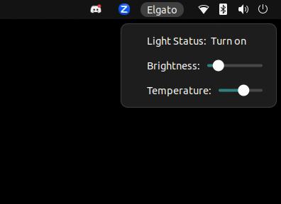

# Elgato Light GNOME shell extension
Interact with an Elgato keylight with a GNOME shell extension. I used this as a way to start familiarizing myself with how to write a shell extension to add controls for my Elgato keylight to the taskbar on my Ubuntu 24.04 desktop (GNOME 46). 

## Setup
Right now, I'm using this as wrapper around the `keylight-control` CLI program from [Tim Richardson](github.com/timrichardson/keylight_control_unofficial), but I'm planning to use the documented [Elgato API from Adam Esch](https://github.com/adamesch/elgato-key-light-api) to implement the API calls directly into the extension. If you decide to use this before I get to that step, make sure you install Tim's CLI tool and find your light's IP address, then paste that into the extension's `gschema.xml` file. 

Extract the folder into `~/.local/share/gnome-shell/extensions/elgato-light@orifox.online`. Feel free to rename it, but if you do, update the application name in `metadata.json` to match the new folder name. If you modify the schema file, you may need to run `glib-compile-schemas schemas/` to recompile. 

Enable the extension with the GNOME Extensions app, or by running: 
`gnome-extensions reset elgato-light@orifox.online && killall -3 gnome-shell && gnome-extensions enable elgato-light@orifox.online`. There might be a better way of doing this, but this is the process and order that I've found to get changes made to the extension to reload. 

If all is well, you will be able to see a new 'Elgato' option in the top right of the taskbar. Clicking on it will reveal the UI where you can turn the light on/off, adjust the brightness, and change the color temperature.

## Debugging
You can watch the logs of the extension by running `journalctl -f -o cat /usr/bin/gnome-shell` in a terminal window to view `log(message)` output and any errors that are thrown by the extension. 

## Thank you
[This CodeProject.com article](https://www.codeproject.com/Articles/5271677/How-to-Create-A-GNOME-Extension) on writing a GNOME extension was extremely helpful in getting the bones of this set up and running. Bard was not, and generated a bunch of garbage code before gaslighting me that I must have changed the non-working code and that's why it didn't work. 

